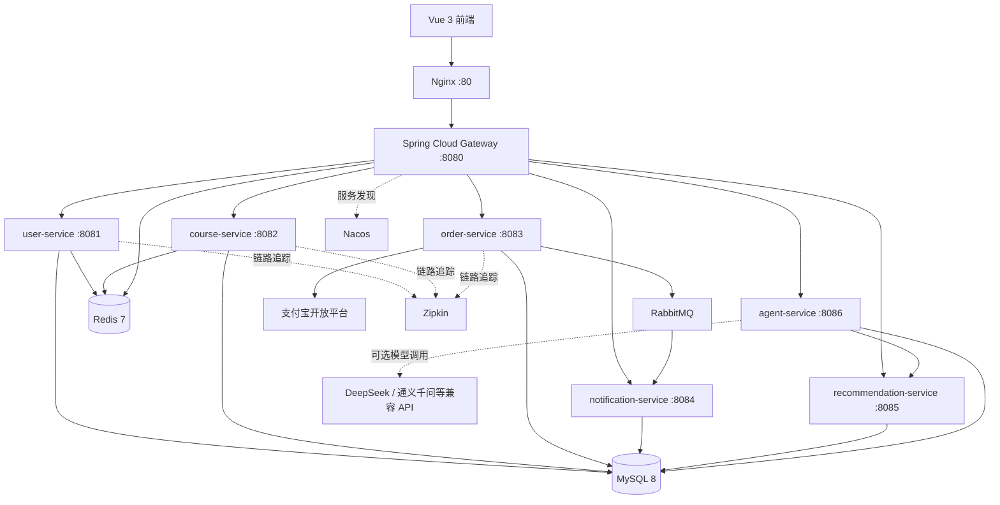

# AI智慧教育平台

基于 Spring Boot、Spring Cloud 与 Vue 3 构建的前后端分离在线教育平台。项目采用微服务架构，提供用户与课程管理、个性化课程推荐、订单与支付宝支付、站内通知、数据统计、链路追踪及 Docker Compose 一键部署能力。

仓库地址：[github.com/gx-bit/AI-Education-Platform](https://github.com/gx-bit/AI-Education-Platform)

## 系统功能

### AI 学习智能体

- 根据学习目标、兴趣、当前水平、周期和每周可用时间调用推荐服务并生成可执行计划。
- 将计划拆成“课程学习、项目实践、面试复盘”三类周任务，支持确认、打卡、撤销和进度统计。
- 草案必须由用户确认后才进入执行状态；涉及付费和选课的高风险动作不会自动执行。
- 每次工具调用写入审计日志，记录动作类型、输入输出、确认要求和执行状态。
- 支持持久化多轮对话记忆，由模型或确定性降级路由选择“课程检索、进度查询”等工具，并返回本次工具名称与耗时。
- 管理端指标接口统计会话量、消息量、工具调用量、平均延迟和模型降级率，便于评测 Agent 的稳定性。
- 可配置 DeepSeek、通义千问等 OpenAI 兼容接口生成个性化计划说明；未配置密钥时自动使用本地可靠降级。

### 学员端

| 模块 | 已实现功能 |
| --- | --- |
| 首页 | 平台数据概览、热门课程展示、学习路径入口、AI 智能推荐入口 |
| 账号与身份 | 用户注册、登录、退出登录、JWT 身份认证、关闭页面后会话失效、记住账号密码、修改个人资料、修改密码、头像展示 |
| 课程广场 | 每页 9 门课程、分类筛选、关键词搜索、难度筛选、价格筛选、综合/评分/热度/价格排序、分页浏览 |
| 课程详情 | 课程封面、价格、讲师、标签、难度、时长、学习人数和课程介绍；访问课程链接自动提取网页目录，支持哔哩哔哩分P/合集解析；已购课程显示“观看课程”并跳转课程链接 |
| 课程互动 | 收藏与取消收藏、我的收藏、查看课程评价、发表或修改评价、星级评分、课程聚合评分实时更新 |
| 选课与订单 | 创建课程订单、复用已有待支付订单、查看我的订单、按状态筛选、取消订单、查询购买状态、支付后自动获得学习权限 |
| 支付 | 免费课程直接报名、本地沙箱完整支付演示、支付宝电脑网站支付、支付结果轮询、支付成功回跳、订单与课程权限联动 |
| 我的学习 | 查看已购买课程、进入课程详情、直接打开管理员配置的课程学习链接 |
| 我的通知 | 通知铃铛和未读角标、全部/未读筛选、分页、单条已读、全部已读、删除通知、点击进入通知详情、订单通知跳转相关订单 |
| 通知详情 | 展示通知类型、标题、完整正文和发送时间；进入后自动已读，支持删除、返回首页以及查看相关订单 |

### AI 智能推荐

| 能力 | 说明 |
| --- | --- |
| 推荐条件 | 支持输入学习兴趣、学习目标和当前水平，输入框默认保持为空，由用户主动描述需求 |
| 推荐优先级 | 优先匹配学习兴趣与学习目标，当前水平用于难度适配，不会压过核心学习意图 |
| 混合排序 | 综合语义相关度、用户画像、课程热度和课程质量生成推荐结果 |
| 推荐解释 | 返回每门课程的推荐理由与各维度匹配分数，便于理解推荐依据 |
| 行为反馈 | 采集曝光、点击、搜索、收藏、下单、购买、学习进度、完成和评分等行为 |
| 持续优化 | 行为数据写入用户画像并参与后续排序，形成“推荐—交互—反馈—再推荐”闭环 |
| 可用性保障 | 推荐服务不可用时提供降级结果；课程服务还保留可选的 Anthropic Claude API 推荐客户端 |

### 管理员后台

管理员使用独立登录入口和管理端布局。管理员账号只进入后台管理空间，与普通学员页面、登录状态和功能权限相互隔离。

| 模块 | 已实现功能 |
| --- | --- |
| 管理工作台 | 核心业务指标、快捷管理入口、平台运营概览和服务状态展示 |
| 用户管理 | 用户分页查询、关键词和状态筛选、查看用户信息、启用或禁用账号；所有操作使用字符串 ID，避免雪花 ID 精度丢失 |
| 课程管理 | 管理端课程列表、新增课程、编辑和删除课程、发布与下架；可维护标题、简介、分类、难度、价格、时长、标签、讲师姓名、封面图和课程链接 |
| 订单管理 | 查看全站订单、按支付状态筛选、查看交易金额、课程、用户和支付时间等信息 |
| 消息中心 | 向全站有效用户或指定用户发布站内通知，配置通知标题与完整正文 |
| 推荐策略 | 查看和调整推荐算法各维度权重及策略配置 |
| 数据看板 | 使用 ECharts 展示用户、课程、订单、收入等运营统计数据 |
| 系统监控 | 检查用户、课程、订单、通知和推荐服务的在线状态，并提供基础设施入口 |

### 支付与交易安全

- 真实支付宝电脑网站支付，使用支付宝 Java SDK 生成支付表单。
- RSA2 验证支付宝异步通知签名，并校验应用 ID、商户 ID、订单号和支付金额。
- 支付通知支持幂等处理，重复回调不会重复计数或重复发放课程权限。
- 订单、用户、课程和通知等雪花 ID 在前端按字符串传输，避免 JavaScript 整数精度丢失。
- 付费订单不能调用免费报名接口绕过收银台；订单查询、支付、取消和通知详情均校验数据归属。
- 本地沙箱收银台与真实支付使用独立入账方式，并明确标注模拟环境，不会发生真实扣款。

### 通知与异步事件

- 订单支付成功后由 `order-service` 发布 RabbitMQ 事件。
- `notification-service` 消费事件并自动生成选课成功站内通知。
- 通知支持未读统计、列表筛选、详情查看、自动已读、全部已读和删除。
- 管理员可发送全站公告或指定用户通知。

### 工程与运维

- Spring Cloud Gateway 统一路由、JWT 鉴权、角色检查和 Redis 限流。
- Nacos 提供服务注册与发现，OpenFeign 完成服务间调用，Resilience4j 提供降级保护。
- MySQL 按服务拆分业务库，MyBatis-Plus 完成数据访问，Redis 提供缓存与会话支撑。
- Zipkin 与 Micrometer Tracing 提供分布式链路追踪，SpringDoc 提供 OpenAPI/Swagger 文档。
- Docker Compose 一键启动前端、七个后端服务及 MySQL、Redis、RabbitMQ、Nacos、Zipkin。
- Nginx 托管 Vue 单页应用并代理 API，支持前端历史路由刷新。
- Jenkinsfile 包含测试、静态分析、镜像构建、镜像推送、测试部署、冒烟验证和生产发布确认。
- 可选 MCP Server 将课程、订单、用户和通知能力封装为 AI Agent 可调用的工具。

## 课程目录自动解析

管理员只需在课程管理页面配置课程链接，学员打开课程详情页的“课程目录”标签后，系统会由后端访问该链接并自动整理课程章节，不再使用前端写死的示例目录。

解析流程：

1. 读取课程对应的公网 HTTP/HTTPS 链接。
2. 对哔哩哔哩视频识别 BV 号，优先整理视频分P与合集章节。
3. 对普通课程网站识别结构化课程数据，以及 `curriculum`、`syllabus`、`outline`、`chapter`、`lesson` 等常见目录区域。
4. 页面没有标准目录时，使用正文中的二级、三级标题作为降级来源。
5. 对结果进行去重、章节编号清理、导航噪声过滤和数量限制后返回前端。

目录页面会显示解析状态、目录来源和完整课时列表，并提供“重新解析”按钮。课程链接未配置、链接失效、目标页面需要登录或网站未公开目录时，页面会展示对应提示。

为防止课程链接被用于访问服务器内部资源，解析服务只允许公网 HTTP/HTTPS 地址，同时具备内网与本机地址拦截、重定向次数限制、8 秒超时、2 MB 响应大小限制和 HTML 内容类型校验。

相关接口：

```http
GET /api/course/{courseId}/outline
```

响应中的 `status` 可能为：

| 状态 | 含义 |
| --- | --- |
| `success` | 成功识别并整理课程目录 |
| `empty` | 已访问链接，但页面没有公开的可识别目录 |
| `unavailable` | 课程尚未配置学习链接 |
| `failed` | 目标页面暂时无法访问或解析失败 |

## AI 推荐实现

当前前端主要使用独立的 `recommendation-service`。它不是简单返回固定课程，也没有自行训练深度学习模型，而是采用混合推荐策略：

1. 采集曝光、点击、收藏、下单、购买、学习进度、完成、评分和搜索行为。
2. 将兴趣、目标、课程标题、描述、标签等文本转换为 384 维哈希特征向量。
3. 使用余弦相似度计算查询意图和用户画像与课程的匹配程度。
4. 按语义相关度 40%、用户画像 25%、课程热度 20%、课程质量 15% 加权排序。
5. 进行分类多样性重排，并记录推荐曝光、点击和购买结果。

`course-service` 中同时保留了 Anthropic Claude API 推荐客户端，可作为大模型推荐能力；未配置 API Key 或调用失败时会降级到本地结果。

## 系统架构



## 求职项目亮点

- **可解释的混合推荐**：不是随机或固定推荐，能够展示语义、画像、热度和质量分数，并通过行为反馈持续调整结果。
- **可执行学习 Agent**：持久化多轮会话，由模型在受控工具集合中选择课程检索或进度查询；学习计划必须人工确认，并记录工具结果、降级状态和响应耗时。
- **完整互动闭环**：收藏与评价使用数据库唯一约束保证幂等，评价更新会在事务内重新计算课程聚合评分，并反馈给推荐画像。
- **真实支付链路**：支付宝下单、RSA2 验签、金额与商户校验、异步回调和支付状态幂等更新组成完整支付闭环。
- **微服务工程化**：Nacos 服务发现、Gateway 统一鉴权与限流、OpenFeign 调用、Resilience4j 降级、RabbitMQ 异步解耦。
- **纵深权限控制**：网关按 HTTP 方法和路径执行最小化白名单，下游课程管理接口再次校验管理员/讲师角色，避免只依赖前端隐藏按钮。
- **可观测与可交付**：Zipkin 链路追踪、Swagger 文档、单元测试、Docker Compose 以及 Jenkins CI/CD。

## 服务说明

| 服务 | 容器端口 | 主要职责 |
| --- | ---: | --- |
| `gateway-service` | 8080 | API 路由、JWT 鉴权、Redis 限流 |
| `user-service` | 8081 | 用户认证、资料与后台用户管理 |
| `course-service` | 8082 | 课程、分类、搜索及 Claude 推荐能力 |
| `order-service` | 8083 | 订单、免费课程与支付宝支付 |
| `notification-service` | 8084 | RabbitMQ 消费和站内通知 |
| `recommendation-service` | 8085 | 行为采集、用户画像、混合排序与反馈闭环 |
| `agent-service` | 8086 | 多轮会话、工具路由、学习计划、任务追踪、审计和评测指标 |
| `frontend` | 80 | Vue 3 用户端与管理端页面 |
| `mcp-server` | stdio | 面向 AI Agent 的可选 MCP 工具服务 |

## 技术栈

| 层次 | 技术 |
| --- | --- |
| 后端 | Java 17、Spring Boot 3.2.4、Spring Cloud 2023.0.1 |
| 微服务 | Spring Cloud Gateway、Nacos、OpenFeign、LoadBalancer、Resilience4j |
| 数据访问 | MySQL 8、MyBatis-Plus 3.5.7 |
| 缓存与限流 | Redis 7、Spring Data Redis |
| 消息队列 | RabbitMQ 3.12、Spring AMQP |
| 安全 | Spring Security、JWT / JJWT 0.12.5 |
| AI 推荐 | 混合推荐算法、余弦相似度、用户行为画像、Anthropic Claude API（可选） |
| AI Agent | 受控工具调用、持久化会话记忆、Human-in-the-loop、模型降级、调用审计、运行评测 |
| 支付 | 支付宝 Java SDK、电脑网站支付、RSA2 验签 |
| 前端 | Vue 3、Vite 5、Element Plus、Pinia、Axios、ECharts |
| 可观测性 | Micrometer Tracing、Brave、Zipkin、SpringDoc OpenAPI |
| 部署 | Docker、Docker Compose、Nginx、Jenkins、SonarQube |

## 快速启动

### 环境要求

- Docker 与 Docker Compose v2
- JDK 17 和 Maven 3.8+（本地编译时需要）
- Node.js 20+（前端或 MCP 本地开发时需要）

### 1. 克隆项目

```bash
git clone git@github.com:gx-bit/AI-Education-Platform.git
cd AI-Education-Platform/edu-platform
```

### 2. 配置环境变量

```bash
cp .env.example .env
```

至少应修改 `.env` 中的 MySQL 密码和 JWT 密钥。Claude、OpenAI 兼容模型与支付宝参数按需填写；不要将包含真实密钥的 `.env` 提交到 Git。

Agent 可选模型配置示例：

```env
AI_BASE_URL=https://api.deepseek.com
AI_API_KEY=your-api-key
AI_MODEL=deepseek-chat
```

不配置上述参数时，Agent 自动切换为确定性工具路由，课程检索、计划生成和进度查询仍可使用。

### 3. 构建并启动

```bash
mvn clean package -DskipTests
docker compose up -d --build
```

如果本机保留了旧版 MySQL 数据卷，首次升级需执行：

```bash
docker compose exec -T mysql mysql -uroot -p"$MYSQL_PASSWORD" < sql/migrate-agent.sql
```

### 4. 访问服务

| 入口 | 本机地址 |
| --- | --- |
| Web 前端 | <http://localhost> |
| API 网关 | <http://localhost:18080> |
| Nacos 控制台 | <http://localhost:8848/nacos> |
| RabbitMQ 管理台 | <http://localhost:15672> |
| Zipkin | <http://localhost:19411> |

### 5. Agent 升级演示

1. 使用普通学员账号登录，顶部进入“学习智能体”。
2. 输入“推荐 Java 微服务课程”，观察回复中显示的 `search_courses` 工具和模型/降级来源。
3. 填写学习目标、兴趣、水平、计划周数和每周时间，生成学习计划草案。
4. 点击“确认并启用计划”，再完成一项任务，观察进度变化。
5. 在对话区输入“我的计划完成多少了”，观察 `get_current_plan` 返回真实进度。
6. 使用管理员账号进入“数据与系统 → Agent 评测”，查看会话量、工具调用量、平均延迟和模型降级率。

Agent 的关键安全边界：模型不能直接修改数据库；所有工具均由后端白名单注册，数据按登录用户隔离，计划启用需要人工确认，支付和选课不会被自动执行。

查看容器状态或停止服务：

```bash
docker compose ps
docker compose down
```

## 支付宝支付配置

付费订单通过支付宝电脑网站支付完成。系统只在支付宝异步通知通过 RSA2 验签，并校验应用、商户、订单号与金额后更新支付状态。建议首先使用支付宝沙箱。

在 `.env` 中配置：

```env
ALIPAY_ENABLED=true
ALIPAY_MOCK_ENABLED=false
ALIPAY_GATEWAY_URL=https://openapi.alipaydev.com/gateway.do
ALIPAY_APP_ID=
ALIPAY_MERCHANT_PRIVATE_KEY=
ALIPAY_PUBLIC_KEY=
ALIPAY_SELLER_ID=
ALIPAY_NOTIFY_URL=https://your-domain/api/order/payment/alipay/notify
ALIPAY_RETURN_URL=http://localhost/payment/result
```

`ALIPAY_NOTIFY_URL` 必须是支付宝能够访问的公网 HTTPS 地址。已有数据库需先执行 `sql/migrate-alipay-payment.sql`。

本地开发未配置支付宝商户凭据时，Docker Compose 默认启用本地沙箱收银台，可完整演示创建支付、确认付款、订单入账和结果回跳，且不会发生真实扣款。生产环境务必设置 `ALIPAY_MOCK_ENABLED=false`，并填写支付宝开放平台提供的应用 ID、应用私钥、支付宝公钥及公网 HTTPS 异步通知地址；配置完整后系统会自动切换到真实支付宝电脑网站支付。

## 本地开发

后端全量测试：

```bash
mvn clean test
```

前端开发：

```bash
cd frontend
npm install
npm run dev
```

只启动基础设施：

```bash
docker compose up -d mysql redis rabbitmq nacos zipkin
```

## MCP Server

`mcp-server` 将课程、订单、用户和通知等接口封装为 MCP 工具，可供 Claude Desktop 等兼容客户端使用。它不在默认 Docker Compose 服务中，需要单独启动：

```bash
cd mcp-server
npm install
cp .env.example .env
npm start
```

配置示例见 `mcp-server/mcp-config.example.json`。

## CI/CD

`Jenkinsfile` 定义了代码检出、Maven 构建与测试、SonarQube 分析、Docker 镜像构建、阿里云镜像仓库推送、测试环境部署、冒烟测试和生产环境人工确认等阶段。

## 项目结构

```text
edu-platform/
├── common/                    # 公共响应、安全与用户上下文
├── gateway-service/           # API 网关
├── user-service/              # 用户服务
├── course-service/            # 课程服务
├── order-service/             # 订单与支付服务
├── notification-service/      # 通知服务
├── recommendation-service/    # 个性化推荐服务
├── agent-service/             # 学习 Agent、会话、工具、计划与评测
├── frontend/                  # Vue 3 前端
├── mcp-server/                # 可选 MCP 工具服务
├── sql/                       # 初始化与迁移脚本
├── docker-compose.yml
└── Jenkinsfile
```

## License

MIT
