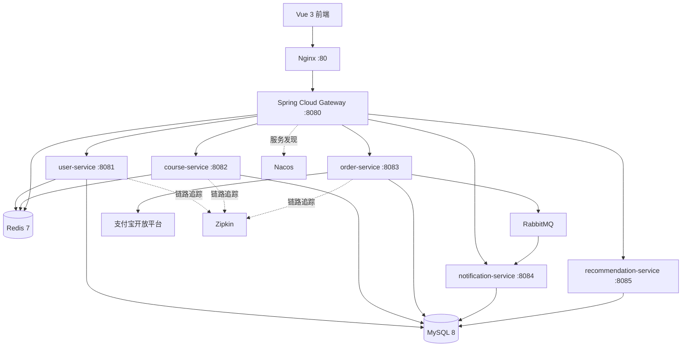

# AI智慧教育平台

基于 Spring Boot、Spring Cloud 与 Vue 3 构建的前后端分离在线教育平台。项目采用微服务架构，提供用户与课程管理、个性化课程推荐、订单与支付宝支付、站内通知、数据统计、链路追踪及 Docker Compose 一键部署能力。

仓库地址：[github.com/gx-bit/AI-Education-Platform](https://github.com/gx-bit/AI-Education-Platform)

## 核心功能

- 用户注册、登录、JWT 鉴权、个人资料与密码管理
- 课程列表、详情、分类、关键词筛选及多维排序
- 管理员课程发布、下架、编辑、删除和用户管理
- 基于用户行为、内容相关度、热度与评分的个性化课程推荐
- 推荐曝光、点击、购买等行为记录及可解释推荐理由
- 课程收藏、我的收藏列表、课程评价与实时聚合评分
- 课程订单创建、查询、取消和支付状态查询
- 支付宝电脑网站支付、RSA2 回调验签和幂等处理
- RabbitMQ 异步事件与站内通知
- 管理后台和 ECharts 数据统计
- Swagger/OpenAPI 接口文档与 Zipkin 分布式链路追踪
- MCP 工具服务，可供 Claude Desktop 等 AI Agent 调用平台接口

## AI 推荐实现

当前前端主要使用独立的 `recommendation-service`。它不是简单返回固定课程，也没有自行训练深度学习模型，而是采用混合推荐策略：

1. 采集曝光、点击、收藏、下单、购买、学习进度、完成、评分和搜索行为。
2. 将兴趣、目标、课程标题、描述、标签等文本转换为 384 维哈希特征向量。
3. 使用余弦相似度计算查询意图和用户画像与课程的匹配程度。
4. 按语义相关度 40%、用户画像 25%、课程热度 20%、课程质量 15% 加权排序。
5. 进行分类多样性重排，并记录推荐曝光、点击和购买结果。

`course-service` 中同时保留了 Anthropic Claude API 推荐客户端，可作为大模型推荐能力；未配置 API Key 或调用失败时会降级到本地结果。

## 系统架构



## 求职项目亮点

- **可解释的混合推荐**：不是随机或固定推荐，能够展示语义、画像、热度和质量分数，并通过行为反馈持续调整结果。
- **完整互动闭环**：收藏与评价使用数据库唯一约束保证幂等，评价更新会在事务内重新计算课程聚合评分，并反馈给推荐画像。
- **真实支付链路**：支付宝下单、RSA2 验签、金额与商户校验、异步回调和支付状态幂等更新组成完整支付闭环。
- **微服务工程化**：Nacos 服务发现、Gateway 统一鉴权与限流、OpenFeign 调用、Resilience4j 降级、RabbitMQ 异步解耦。
- **纵深权限控制**：网关按 HTTP 方法和路径执行最小化白名单，下游课程管理接口再次校验管理员/讲师角色，避免只依赖前端隐藏按钮。
- **可观测与可交付**：Zipkin 链路追踪、Swagger 文档、单元测试、Docker Compose 以及 Jenkins CI/CD。

## 服务说明

| 服务 | 容器端口 | 主要职责 |
| --- | ---: | --- |
| `gateway-service` | 8080 | API 路由、JWT 鉴权、Redis 限流 |
| `user-service` | 8081 | 用户认证、资料与后台用户管理 |
| `course-service` | 8082 | 课程、分类、搜索及 Claude 推荐能力 |
| `order-service` | 8083 | 订单、免费课程与支付宝支付 |
| `notification-service` | 8084 | RabbitMQ 消费和站内通知 |
| `recommendation-service` | 8085 | 行为采集、用户画像、混合排序与反馈闭环 |
| `frontend` | 80 | Vue 3 用户端与管理端页面 |
| `mcp-server` | stdio | 面向 AI Agent 的可选 MCP 工具服务 |

## 技术栈

| 层次 | 技术 |
| --- | --- |
| 后端 | Java 17、Spring Boot 3.2.4、Spring Cloud 2023.0.1 |
| 微服务 | Spring Cloud Gateway、Nacos、OpenFeign、LoadBalancer、Resilience4j |
| 数据访问 | MySQL 8、MyBatis-Plus 3.5.7 |
| 缓存与限流 | Redis 7、Spring Data Redis |
| 消息队列 | RabbitMQ 3.12、Spring AMQP |
| 安全 | Spring Security、JWT / JJWT 0.12.5 |
| AI 推荐 | 混合推荐算法、余弦相似度、用户行为画像、Anthropic Claude API（可选） |
| 支付 | 支付宝 Java SDK、电脑网站支付、RSA2 验签 |
| 前端 | Vue 3、Vite 5、Element Plus、Pinia、Axios、ECharts |
| 可观测性 | Micrometer Tracing、Brave、Zipkin、SpringDoc OpenAPI |
| 部署 | Docker、Docker Compose、Nginx、Jenkins、SonarQube |

## 快速启动

### 环境要求

- Docker 与 Docker Compose v2
- JDK 17 和 Maven 3.8+（本地编译时需要）
- Node.js 20+（前端或 MCP 本地开发时需要）

### 1. 克隆项目

```bash
git clone git@github.com:gx-bit/AI-Education-Platform.git
cd AI-Education-Platform/edu-platform
```

### 2. 配置环境变量

```bash
cp .env.example .env
```

至少应修改 `.env` 中的 MySQL 密码和 JWT 密钥。Claude 与支付宝参数按需填写；不要将包含真实密钥的 `.env` 提交到 Git。

### 3. 构建并启动

```bash
mvn clean package -DskipTests
docker compose up -d --build
```

### 4. 访问服务

| 入口 | 本机地址 |
| --- | --- |
| Web 前端 | <http://localhost> |
| API 网关 | <http://localhost:18080> |
| Nacos 控制台 | <http://localhost:8848/nacos> |
| RabbitMQ 管理台 | <http://localhost:15672> |
| Zipkin | <http://localhost:19411> |

查看容器状态或停止服务：

```bash
docker compose ps
docker compose down
```

## 支付宝支付配置

付费订单通过支付宝电脑网站支付完成。系统只在支付宝异步通知通过 RSA2 验签，并校验应用、商户、订单号与金额后更新支付状态。建议首先使用支付宝沙箱。

在 `.env` 中配置：

```env
ALIPAY_ENABLED=true
ALIPAY_MOCK_ENABLED=false
ALIPAY_GATEWAY_URL=https://openapi.alipaydev.com/gateway.do
ALIPAY_APP_ID=
ALIPAY_MERCHANT_PRIVATE_KEY=
ALIPAY_PUBLIC_KEY=
ALIPAY_SELLER_ID=
ALIPAY_NOTIFY_URL=https://your-domain/api/order/payment/alipay/notify
ALIPAY_RETURN_URL=http://localhost/payment/result
```

`ALIPAY_NOTIFY_URL` 必须是支付宝能够访问的公网 HTTPS 地址。已有数据库需先执行 `sql/migrate-alipay-payment.sql`。

本地开发未配置支付宝商户凭据时，Docker Compose 默认启用本地沙箱收银台，可完整演示创建支付、确认付款、订单入账和结果回跳，且不会发生真实扣款。生产环境务必设置 `ALIPAY_MOCK_ENABLED=false`，并填写支付宝开放平台提供的应用 ID、应用私钥、支付宝公钥及公网 HTTPS 异步通知地址；配置完整后系统会自动切换到真实支付宝电脑网站支付。

## 本地开发

后端全量测试：

```bash
mvn clean test
```

前端开发：

```bash
cd frontend
npm install
npm run dev
```

只启动基础设施：

```bash
docker compose up -d mysql redis rabbitmq nacos zipkin
```

## MCP Server

`mcp-server` 将课程、订单、用户和通知等接口封装为 MCP 工具，可供 Claude Desktop 等兼容客户端使用。它不在默认 Docker Compose 服务中，需要单独启动：

```bash
cd mcp-server
npm install
cp .env.example .env
npm start
```

配置示例见 `mcp-server/mcp-config.example.json`。

## CI/CD

`Jenkinsfile` 定义了代码检出、Maven 构建与测试、SonarQube 分析、Docker 镜像构建、阿里云镜像仓库推送、测试环境部署、冒烟测试和生产环境人工确认等阶段。

## 项目结构

```text
edu-platform/
├── common/                    # 公共响应、安全与用户上下文
├── gateway-service/           # API 网关
├── user-service/              # 用户服务
├── course-service/            # 课程服务
├── order-service/             # 订单与支付服务
├── notification-service/      # 通知服务
├── recommendation-service/    # 个性化推荐服务
├── frontend/                  # Vue 3 前端
├── mcp-server/                # 可选 MCP 工具服务
├── sql/                       # 初始化与迁移脚本
├── docker-compose.yml
└── Jenkinsfile
```

## License

MIT
